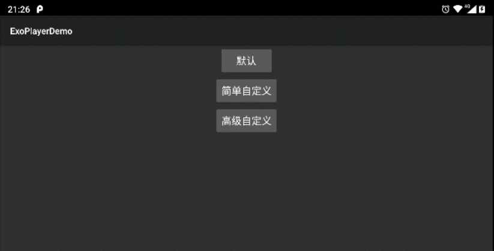

# ExoPlayerDemo
ExoPlayer的简单实用可以参考https://blog.csdn.net/BigBoySunshine/article/details/102657428。这里主要讲解如何自定义ui.

## 自定义UI

#### 1，简单自定义

​        这种方式是通过修改ExoPlayer预留的布局文件来实现定制化，但是这种方式只能修改特定的一些UI。

在源代码中可以找到

```java
int controllerLayoutId = R.layout.exo_player_control_view;
```

​		也就是说ExoPlayer默认使用的是这个布局，我们可以在代码中新建一个名为：exo_player_control_view 的layout，或者在xml中添加

```xml
<com.google.android.exoplayer2.ui.PlayerView
   android:id="@+id/video_view"
   android:layout_width="match_parent"
   android:layout_height="match_parent"
   app:controller_layout_id="@layout/xxx_view"/>
```

​		指定我们的layout来实现覆盖的目的。如下：

```xml
<FrameLayout xmlns:android="http://schemas.android.com/apk/res/android"
    xmlns:app="http://schemas.android.com/apk/res-auto"
    android:layout_width="match_parent"
    android:layout_height="match_parent">
 
    <android.support.constraint.ConstraintLayout
        android:layout_width="match_parent"
        android:layout_height="wrap_content"
        android:layout_gravity="bottom"
        android:background="@drawable/player_bottom_bg">
 
        <TextView
            android:id="@+id/exo_position"
            android:layout_width="wrap_content"
            android:layout_height="wrap_content"
            android:layout_marginStart="10dp"
            android:layout_marginEnd="10dp"
            android:layout_marginTop="10dp"
            android:textColor="@android:color/white"
            app:layout_constraintLeft_toLeftOf="parent" />
 
        <TextView
            android:id="@+id/exo_duration"
            android:layout_width="wrap_content"
            android:layout_height="wrap_content"
            android:layout_marginEnd="10dp"
            android:layout_marginStart="10dp"
            android:layout_marginTop="10dp"
            android:textColor="@android:color/white"
            app:layout_constraintRight_toRightOf="parent" />
 
        <com.google.android.exoplayer2.ui.DefaultTimeBar
            android:id="@id/exo_progress"
            android:layout_width="0dp"
            android:layout_height="26dp"
            android:layout_weight="1"
            app:layout_constraintBottom_toBottomOf="@id/exo_position"
            app:layout_constraintLeft_toRightOf="@id/exo_position"
            app:layout_constraintRight_toLeftOf="@id/exo_duration"
            app:layout_constraintTop_toTopOf="@id/exo_position"
            app:played_color="#FFDE81"
            app:unplayed_color="@android:color/black"
            app:buffered_color="@android:color/darker_gray"/>
 
        <ImageView
            android:id="@+id/exo_play"
            android:layout_width="wrap_content"
            android:layout_height="wrap_content"
            android:src="@drawable/play_btn"
            app:layout_constraintLeft_toLeftOf="parent"
            app:layout_constraintRight_toRightOf="parent"
            app:layout_constraintTop_toBottomOf="@id/exo_progress" />
 
        <ImageView
            android:id="@+id/exo_pause"
            android:layout_width="wrap_content"
            android:layout_height="wrap_content"
            android:src="@drawable/pause_btn"
            app:layout_constraintLeft_toLeftOf="parent"
            app:layout_constraintRight_toRightOf="parent"
            app:layout_constraintTop_toBottomOf="@id/exo_progress" />
 
        <android.support.constraint.Guideline
            android:id="@+id/gl"
            android:layout_width="wrap_content"
            android:layout_height="match_parent"
            android:orientation="vertical"
            app:layout_constraintGuide_percent="0.5"
            />
 
        <ImageView
            android:id="@+id/exo_rew"
            android:layout_width="wrap_content"
            android:layout_height="wrap_content"
            android:src="@drawable/pre_btn"
            android:layout_marginEnd="8dp"
            app:layout_constraintRight_toLeftOf="@id/gl"
            app:layout_constraintTop_toTopOf="@id/exo_play" />
 
        <ImageView
            android:id="@+id/exo_ffwd"
            android:layout_width="wrap_content"
            android:layout_height="wrap_content"
            android:src="@drawable/next_btn"
            android:layout_marginStart="8dp"
            app:layout_constraintLeft_toRightOf="@id/gl"
            app:layout_constraintTop_toTopOf="@id/exo_play" />
 
    </android.support.constraint.ConstraintLayout>
</FrameLayout>
```

效果如下：



缺点：

​        这种方式控件的id不能随便起，要与exoPlayer原来PlaybackControlView的布局控件id，名称一致，不然就人家的代码中是获取不到你的id的。

​        有这些控件id可以使用：

-  exo_play –>播放
- exo_pause –>暂停
- exo_rew –>后退
- exo_ffwd –>前进
- exo_prev –>上一个
- exo_next –>下一个
- exo_repeat_toggle –>重复模式开关
- exo_duration –>视频总时长
- exo_position –>当前播放位置
- exo_progress –>播放进度

#### 2，高级自定义

​        高级自定义可以实现任意的效果，如下：


1，首先需要重写: com.google.android.exoplayer2.ui.PlayerView。这里的“重写”是指新建一个类比如MyPlayerView，然后复制PlayerView中的代码到MyPlayerView。使用时引用MyPlayerView。

2，引入自定义的布局，如：senior_diy_player_control_view.xml，通过controller_layout_id属性设置布局，如下：

```xml
<com.example.exoplayerdemo.custom.MyPlayerView
    android:id="@+id/video_view"
    android:layout_width="match_parent"
    android:layout_height="match_parent"
    app:show_buffering="always"
    app:controller_layout_id="@layout/senior_diy_player_control_view"
    app:layout_constraintBottom_toBottomOf="parent"
    app:layout_constraintLeft_toLeftOf="parent"
    app:layout_constraintRight_toRightOf="parent"
    app:layout_constraintTop_toTopOf="parent"/>
```

3，改变了布局以后需要添加自定义的事件，需要重写com.google.android.exoplayer2.ui.PlayerControlView，跟上面一样新建一个MyPlayerControlView，然后把代码复制进去，同时需要把MyPlayerView中所有的PlayerControlView的引用改为MyPlayerControlView的引用，此时MyPlayerControlView就生效了，在这里可以找到原布局中的播放、暂停、快进、快退按钮：

```java
private final View playButton;
private final View pauseButton;
private final View fastForwardButton;
private final View rewindButton;
```

以及对应的点击事件：

```java
playButton = findViewById(R.id.exo_play);
if (playButton != null) {
    playButton.setOnClickListener(componentListener);
}
pauseButton = findViewById(R.id.exo_pause);
if (pauseButton != null) {
    pauseButton.setOnClickListener(componentListener);
}
```

以及具体的事件方法：

```java
@Override
public void onClick(View view) {
    ...
    if (playButton == view) {
        ...
    } else if (pauseButton == view) {
        ...
    }
    ...
}
```

接下来怎么做就不用多说了。

4，此时还不能改变进度条的样式，进度条通过com.google.android.exoplayer2.ui.DefaultTimeBar实现的，如果要改变进度条样式就需要重写DefaultTimeBar，和上面的一样，新建一个MyTimeBar，把代码复制进去，修改MyPlayerControlView中对DefaultTimeBar的引用，DefaultTimeBar继承自View，修改样式也就是自定义View的操作，比如我这里把原来的进度改成圆头的代码：

```java
private void drawTimeBar(Canvas canvas) {
    ..
    if (duration <= 0) {
//      canvas.drawRect(progressBar.left, barTop, progressBar.right, barBottom, unplayedPaint);
      // 改为圆角
      canvas.drawRoundRect(progressBar.left, barTop, progressBar.right, barBottom, barHeight/2,barHeight/2, unplayedPaint);
      return;
    }
    ...
    if (progressLeft < progressBar.right) {
//      canvas.drawRect(progressLeft, barTop, progressBar.right, barBottom, unplayedPaint);
      // 改为圆角
      canvas.drawRoundRect(scrubberBar.left, barTop, progressBar.right, barBottom, barHeight/2,barHeight/2,unplayedPaint);
    }
    ...
    if (bufferedRight > bufferedLeft) {
//      canvas.drawRect(bufferedLeft, barTop, bufferedRight, barBottom, bufferedPaint);
      // 改为圆角
      canvas.drawRoundRect(bufferedLeft, barTop, bufferedRight, barBottom, barHeight/2,barHeight/2,bufferedPaint);
    }
    if (scrubberBar.width() > 0) {
//      canvas.drawRect(scrubberBar.left, barTop, scrubberBar.right, barBottom, playedPaint);
      // 改为圆角
      canvas.drawRoundRect(scrubberBar.left, barTop, scrubberBar.right, barBottom, barHeight/2,barHeight/2, playedPaint);
    }
    ...
}
```


